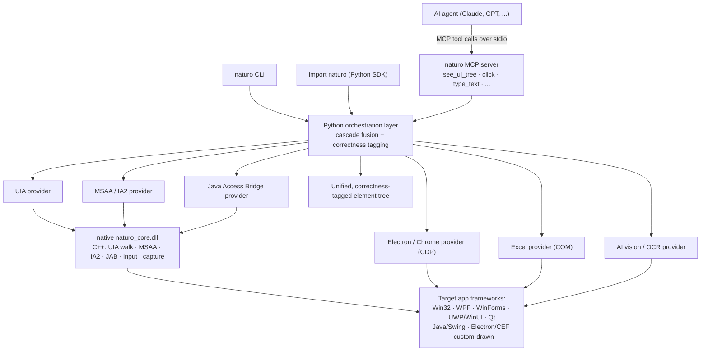
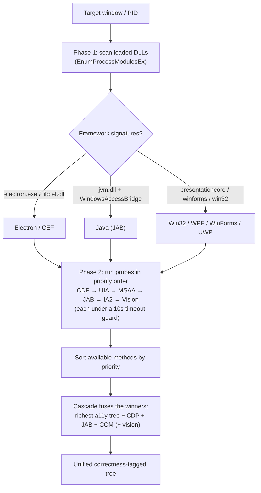

# How Naturo Works — Cross-Framework Windows Automation, Explained

*A technical deep dive into naturo's architecture: why Windows UI automation is
hard, what existing tools can and can't see, and how naturo fuses several
recognition frameworks into one correctness-tagged element tree.*

> This is an engineering explainer aimed at people who build automation, RPA, or
> desktop AI agents. Every architectural claim below is grounded in the naturo
> codebase; the files are named inline so you can read the source yourself.

---

## 1. The problem: there is no single API that sees every Windows app

If you want to automate a native desktop application programmatically — read its
controls, click a button, type into a field — you need the operating system (or
the app) to *expose* its UI structure to you. On Windows there is no one API that
does this for every app. There are several, and each covers a different slice of
the ecosystem:

- **UI Automation (UIA)** — the modern Microsoft accessibility API. Covers Win32,
  WinForms, WPF, and UWP/WinUI well.
- **MSAA / IAccessible** — the older Microsoft Active Accessibility API. Still the
  best (sometimes the only) way into legacy MFC, VB6, Delphi, and some
  custom-drawn apps.
- **IAccessible2 (IA2)** — an accessibility extension used by Firefox,
  Thunderbird, and LibreOffice.
- **Java Access Bridge (JAB)** — the *only* structured way into Java Swing / SWT
  apps (JetBrains IDEs, DBeaver, many enterprise tools). Without it, Java windows
  look empty to Windows accessibility APIs.
- **Chrome DevTools Protocol (CDP)** — the way into Chromium content. Electron and
  CEF apps (VS Code, Slack, Teams, Discord, Feishu/Lark, …) render their entire UI
  as a web page inside a native frame.
- **Custom-drawn UI** — some apps (games, finance terminals, bespoke toolkits)
  paint their own pixels and expose *no* accessibility tree at all. The only way
  in is vision / OCR.

The uncomfortable consequence: **a tool built on any single API is structurally
blind to large, common classes of application.** Two of the most important
enterprise stacks illustrate this sharply:

- An **Electron/CEF app**'s web content is a single opaque node to UIA. A UIA-only
  tool sees the window chrome (title bar, min/max buttons) but *none* of the page's
  buttons, links, inputs, list items, or messages.
- A **Java Swing app**'s controls live below a `SunAwtFrame` that UIA cannot
  descend into. Without the Java Access Bridge the tree is empty or shallow.

Naturo's thesis is that robust desktop automation requires **fusing multiple
recognition frameworks into one tree**, not betting on any single API — and doing
so while being honest about which elements were found deterministically versus
estimated.

---

## 2. Existing solutions and where they stop

To be fair to the prior art: each of these tools is good at what it was designed
for. The point here is scope, not quality.

| Tool | Recognition basis | Consequence |
| --- | --- | --- |
| **PyAutoGUI** | Screen pixels + coordinates | No notion of UI structure. It can click a pixel and match an image template, but it can't enumerate controls, read a control's value, or tell a button from a label. |
| **pywinauto** | UIA and Win32 message backends | Rich structured automation for native Windows apps; you choose the backend per app. No Electron/CDP or Java Access Bridge provider, so web-rendered and Java content is out of reach. |
| **WinAppDriver** | UIA, exposed over the WebDriver protocol | Standard WebDriver ergonomics for UIA-visible apps. UIA-only, and no longer actively maintained by Microsoft. |

The checkable, non-controversial claim naturo makes is narrow and specific:
**these tools are built on single-source accessibility APIs and ship no CDP or
Java Access Bridge element provider, so they cannot see Electron or Java app
*content*.** That is not a knock on their engineering — it's a description of
their scope.

Naturo backs this with a **reproducible benchmark** rather than marketing numbers.
The benchmark measures, on the *same window in the same state*, how many elements
naturo recognizes two ways: the full cascade (`run_cascade(backend_name="auto")`)
versus a UIA-only baseline (`run_cascade(backend_name="uia")`). The UIA-only
baseline is produced by naturo's *own* engine, so the comparison is apples-to-apples
on identical app state — no competitor needs to be installed, and the delta is
exactly the multi-framework advantage. See
[`docs/RECOGNITION.md`](../RECOGNITION.md) for the methodology and the measured
rows; representative results are discussed in [§6](#6-performance-and-the-benchmark).

---

## 3. Naturo's approach: the cascade and the Unified Element Tree

Naturo runs a **cascade** of recognition providers and fuses their results into a
single element tree. The provider order, from the correctness module
(`naturo/cascade/_correctness.py`), is:

```
UIA → MSAA / IAccessible2 → Java Access Bridge → Electron / CDP → COM (Excel) → Vision / OCR
```

Two design commitments make this practical rather than a science project:

1. **Cheap by default, deep on demand.** The default path is UIA-only and adds no
   latency. Heavier providers are only engaged when they can help — CDP when an
   Electron/Chromium debug port is present, JAB when a Java window is detected,
   AI vision only when explicitly requested or when accessibility coverage is
   thin. Every provider is optional; if CDP or AI is unavailable, the cascade
   degrades gracefully to what it has.

2. **Correctness tagging.** Every fused node records *how* it was found, and
   naturo separates recognition techniques into two classes
   (`naturo/cascade/_correctness.py`):

   - **Deterministic** — `uia`, `msaa`, `ia2`, `jab`, `cdp`, `com`. Structured,
     reproducible hits from an accessibility or automation API. Confidence `1.0`.
   - **Uncertain** — `image`, `ocr`, `vision`, `ai`. Estimated hits from image
     matching, local OCR, or an AI vision model. Confidence is the model/match
     score, clamped to `[0.0, 1.0]`.

   A node is tagged **deterministic if *any* of its techniques is deterministic**,
   and unknown techniques are treated as uncertain by default — a fail-safe so
   naturo never claims correctness it cannot justify. When a fused tree contains
   any AI/image-only nodes, `uncertain_warning()` emits a human-readable caution
   that those bounds are estimated and may shift, and that deterministic sources
   are preferred for actions.

This is the moat: not "we call more APIs," but "we fuse them into one tree and
tell you, per element, whether the position and identity are guaranteed or
guessed."

### Architecture at a glance



---

## 4. Architecture deep dive

### 4.1 Framework detection: probe, then pick

Before naturo can recognize a window it figures out *what kind of app it is* and
*which providers can reach it*. This is the detection chain
(`naturo/detect/chain.py`, `naturo/detect/probes.py`), and it runs in two phases.

**Phase 1 — DLL-signature scan.** `detect_frameworks_from_dlls()` enumerates the
target process's loaded modules (via `EnumProcessModulesEx` through `psapi`) and
matches them against known signatures: `electron.exe` / `libcef.dll` → Electron/CEF,
`chrome.dll` → Chrome, `presentationcore.dll` → WPF, `system.windows.forms.dll` →
WinForms, `qt5core.dll` / `qt6core.dll` → Qt, `jvm.dll` / `java.dll` → Java,
`windowsaccessbridge-64.dll` → JAB is enabled, `windows.ui.xaml.dll` /
`microsoft.ui.xaml.dll` → UWP/WinUI. When the DLL scan is unavailable it falls
back to executable-name and install-path heuristics (for example, Windows 11's
UWP Notepad).

**Phase 2 — probes.** A set of probe functions each answer "is this interaction
method actually available for this process?" They run in priority order
(`_DEFAULT_PROBES`): `probe_cdp`, `probe_uia`, `probe_msaa`, `probe_jab`,
`probe_ia2`, `probe_vision`. Each returns an `InteractionMethod` (with a status
like *available*, *unavailable*, or *fallback*) or `None`. A few details worth
calling out, because they're where the engineering lives:

- **Every probe runs under a hard 10-second timeout in a daemon thread**
  (`_run_probe_with_timeout`). CDP's command-line lookup and UIA's COM calls can
  hang on certain apps, so a hung probe can never wedge the whole chain. Because
  COM is apartment-threaded, each probe thread calls `CoInitializeEx` before doing
  UIA work.
- **`probe_cdp`** looks for a `--remote-debugging-port=` argument on the process's
  command line (and checks common ports like 9222/9229/9333). If it finds an
  Electron/CEF process with *no* debug port, it reports CDP as *unavailable* with a
  note explaining how to relaunch with a debug port — an honest "this is possible
  but not enabled" rather than silence.
- **`probe_uia`** first tries the native core's `get_element_tree` at depth 1. For
  UWP/WinUI apps whose top-level `ApplicationFrameWindow` yields an empty tree, it
  descends into the real content child windows (`CoreWindow`,
  `DesktopWindowXamlSource`), then falls back to a `comtypes` path if the native
  DLL is unavailable.
- **`probe_vision`** always returns a *fallback* method — vision works on anything,
  including custom-drawn UI, at the cost of being slower and estimated.

The chain then sorts the available methods by priority and records a recommended
one. Results are cached per-PID so repeated operations on the same app don't
re-probe.



### 4.2 The native C++ core and the Python bridge

Naturo is split deliberately: a small, fast **native C++ core** does the work that
must talk directly to Windows COM/UIA and inject input; a **Python orchestration
layer** does everything else — the cascade, fusion, tagging, CLI, SDK, and MCP
server.

**Why a native core?** The element-tree walk is the hot path, and UIA is a
cross-process COM API where each property read is an IPC round-trip. The core
(`core/src/element.cpp`) uses `IUIAutomationCacheRequest` to batch a whole set of
properties — Name, ControlType, AutomationId, BoundingRectangle, keyboard
shortcut, pattern-availability flags (Value/Text/Invoke/Toggle), and accessibility
metadata (enabled/offscreen/focusable/help text) — into **a single COM call per
element**, then walks the tree with `GetFirstChildElementBuildCache` /
`GetNextSiblingElementBuildCache`. The file's own header notes this cuts IPC
overhead by roughly 4×. It also derives *true* per-node capabilities from UIA
pattern availability rather than guessing from the role: a node is `readable` if it
exposes a Value or Text pattern, `editable` if it has a writable ValuePattern,
`actionable` if it has Invoke or Toggle. The core also implements value reading
(`naturo_get_element_value`) by trying UIA patterns in order — TextPattern first
for text editors (so a large document comes back whole rather than a scrambled
fragment), then Value, Toggle, Selection, and RangeValue.

Input lives in the core too (`core/src/input.cpp`), built on the Win32 `SendInput`
API: mouse move/click/scroll, Unicode text entry, named-key presses, and hotkey
combos with a modifier bitmask. It additionally offers a *hardware* input path
(Phys32) that emits raw PS/2 scan codes via `KEYEVENTF_SCANCODE`, which some games
and anti-cheat systems treat differently from synthetic virtual-key input.

The core exports MSAA, IAccessible2, and JAB tree/find entry points alongside UIA,
so all the structured accessibility backends share one native surface.

**The Python bridge** (`naturo/bridge/_core.py`) is a `ctypes` wrapper —
`NaturoCore` — around `naturo_core.dll`. It:

- **Loads the DLL** from, in order: the `NATURO_CORE_PATH` env var, the packaged
  `bin/` directory shipped in the wheel, the current directory, then the system
  search path.
- **Initializes COM** via `naturo_init()` before any UIA call — without it the
  native tree walk silently returns nothing.
- **Manages buffers**: native functions serialize their result as JSON into a
  caller-provided buffer; the bridge starts with a 1 MB buffer and, on the "buffer
  too small" return code, retries with a larger one (up to 8 MB), then parses the
  JSON into `ElementInfo` dataclasses.

`ElementInfo` and `WindowInfo` are defined in `naturo/backends/base.py`, which also
declares the abstract `Backend` interface every platform implements. `get_backend()`
dispatches to `WindowsBackend`, `MacOSBackend`, or `LinuxBackend` by
`platform.system()` — the seam that keeps the orchestration layer platform-agnostic
while today only the Windows backend is fully implemented.

The layering, bottom to top:

```
AI agent / CLI / Python SDK        (orchestration entry points)
        │
Python orchestration               cascade fusion, correctness tagging, snapshots
        │
ctypes bridge (NaturoCore)         DLL load, COM init, buffer mgmt, JSON → ElementInfo
        │
C API (exports.h)                  naturo_get_element_tree, naturo_key_type, ...
        │
C++ core (naturo_core.dll)         UIA / MSAA / IA2 / JAB walk, SendInput, capture
```

### 4.3 Cascade fusion and how sources are merged

The cascade entry point is `run_cascade()` in `naturo/cascade/_run.py`. Its
`backend_name` parameter selects the mode: a single backend (`"uia"`, `"msaa"`,
`"ia2"`, `"jab"`, `"cdp"`), `"hybrid"` (per-node backend selection), or `"auto"`
(the full cascade). In `"auto"` mode the fusion works in stages:

1. **Pick the richest accessibility base tree.** Naïvely taking "the first
   non-empty tree" is wrong: a custom-drawn or legacy app often returns a *thin
   but non-empty* UIA frame (a few chrome nodes, none of the real controls), so
   MSAA or JAB — which actually see the controls — would never be tried. Instead,
   auto mode competes UIA against MSAA and keeps the tree with the most nodes,
   with UIA winning ties (a heavier backend only wins if it *dwarfs* UIA). Crucially,
   it also consults **class-authoritative routing**: a window whose class maps to a
   known provider (a `SunAwt*` class → JAB, a `Mozilla*` class → IA2) is opaque to
   UIA *by construction*, so naturo trusts the class over any node-count heuristic
   and adds that provider to the competition.

2. **Additive providers graft onto the base.** Once a base tree is chosen, the
   cascade layers on the providers that reach content the base can't:
   - **CDP** for Electron/Chromium renderer content, when a debug port exists;
   - **JAB** for Swing controls, when a Java window is detected and JAB wasn't
     already the base;
   - **COM** for live Excel cell content;
   - **OCR / AI vision** as a final gap-fill, when requested via `fill_gaps_ai`
     or when coverage is below target.

3. **Tag and summarize.** Each element carries a `source` (and, for duplicates
   fused during merge, a `corroborated_by` list). `node_techniques()` collects
   every technique that saw a node, deterministic-first, so the first entry is the
   *preferred* technique used for actions and reads. `recognition_summary()` walks
   the fused tree and returns per-technique counts, the number of uncertain nodes,
   and whether any uncertain nodes exist — the data behind `see --stats` and the
   uncertain-node warning. Nodes with no technique tag (for example, a plain
   `get_element_tree` walk that didn't go through the cascade) are left untagged
   and never falsely reported as uncertain.

The result is a `CascadeResult` carrying the merged `tree`, `stats` (per-provider
element counts and timings), and the snapshot session. Deduplication during merge
uses geometric intersection (IoU) and text-proximity matching so a control seen by
two providers becomes one node with two corroborating techniques, not two nodes.

### 4.4 MCP integration: naturo as an agent tool server

Naturo exposes its automation surface to AI agents through the **Model Context
Protocol**. The tool groups live under `naturo/mcp/` — each module provides a
`register_*_tools(server, get_backend, safe_tool)` function that registers a group
of related tools onto a FastMCP server (`_input.py`, `_inspect.py`, `_window.py`,
`_app.py`, `_dialog.py`, `_excel.py`, `_word.py`, and so on). You start the server
with:

```bash
naturo mcp start          # stdio transport (what agents expect)
```

There are 60+ tools; the ones an agent reaches for most are `see_ui_tree`,
`click`, `type_text`, `press_key`, `launch_app`, `list_windows`, and
`capture_window`. `see_ui_tree` returns a compact, token-lean text tree by
default (`eN <role> "<name>"` lines), supports `cascade=true` to fuse the
multi-framework tree, and accepts a `match=` intent filter so an agent can ask for
only the elements it cares about instead of the whole tree. Naturo's input tools
re-read the UI after acting and report `"verified": true` only when the change
actually landed — and return `"success": false` rather than pretending when it
didn't.

For distribution, naturo ships two manifests so the same server drops into
different clients without hand-writing config:

- An **MCP registry manifest** (`server.json`) describing the pypi package and its
  `naturo mcp start` stdio invocation.
- A **Claude Desktop bundle** (`packaging/mcpb/manifest.json`, an `.mcpb`
  one-click extension). The build produces two flavours: a **thin wrapper** that
  calls the installed `naturo mcp start` (requires `pip install naturo` first),
  and a **self-contained** bundle (#997) that vendors an embedded CPython 3.12
  runtime *and* the native `naturo_core.dll`, so its manifest launches
  `.../server/runtime/python/python.exe -m naturo mcp start` with no prior install
  at all. The self-contained variant is the recently landed step toward
  zero-prerequisite distribution.

---

## 5. Code examples (real, verified API)

The examples below use only APIs that exist in the codebase — cross-checked against
`naturo/sdk.py`, the CLI, `naturo/mcp/`, and the existing tutorials in
`docs/tutorials/`.

### Example 1 — Script a native app end-to-end (CLI)

The four verbs every naturo automation is built from — see, type, press, and drive
a dialog — driving Windows Notepad:

```bash
# Launch and block until the window exists
naturo app launch notepad --wait-until-ready --timeout 5

# See the UI as a compact element tree (no screenshot, no wasted tokens)
naturo see --window "Notepad" --compact

# Type through the IME-immune ladder (focuses Notepad first)
naturo type "Hello from naturo!" --app notepad

# Save: Ctrl+S, then fill the Save As dialog and confirm in one call
naturo press ctrl+s --app notepad
naturo wait --window "Save As" --timeout 5
naturo dialog type "naturo-hello.txt" --accept
```

`naturo type` routes through naturo's reliability ladder (UIA `ValuePattern` →
clipboard paste → keystroke) and reports which rung actually delivered the text —
the mechanism that keeps CJK/IME input from being corrupted.

### Example 2 — Read multi-framework content the UIA-only path misses (Python SDK)

`import naturo` gives an in-process API over the same engine. The key line is
`cascade=True`, which fuses UIA + CDP/JAB/COM into one correctness-tagged tree —
so this reads content a UIA-only walk cannot reach (VS Code / Electron renderer
controls, Swing controls under a `SunAwtFrame`, live Excel cells):

```python
import naturo

# Attach to a running Electron app (e.g. VS Code launched with a CDP debug port),
# or any window by title.
tree = naturo.see(window="Visual Studio Code", cascade=True)

for el in tree.descendants():
    # In the cascade tree, renderer controls that UIA collapses into one opaque
    # node are present here — recovered by the CDP provider.
    if el.role in ("Button", "Hyperlink", "Edit") and el.name:
        print(f"{el.role}: {el.name}")
```

The same `cascade=True` flag is what turns a UIA-only tree of window chrome into a
tree that includes the app's actual interactive content. Under the hood this is the
`run_cascade(backend_name="auto")` path from [§4.3](#43-cascade-fusion-and-how-sources-are-merged).

### Example 3 — Give an AI agent desktop control (MCP)

Zero-code path: register naturo's MCP server with an agent, and it gains all 60+
desktop tools.

```bash
# Point Claude Code at naturo (then restart it)
claude mcp add naturo -- naturo mcp start
```

```jsonc
// ...or hand-write the Claude Desktop config (claude_desktop_config.json)
{
  "mcpServers": {
    "naturo": { "command": "naturo", "args": ["mcp", "start"] }
  }
}
```

Now the agent can call `launch_app`, `see_ui_tree` (with `cascade=true` and
`match=`), `type_text`, `press_key`, and the rest — and because every input tool
verifies its effect, the agent never claims success it can't confirm.

---

## 6. Performance and the benchmark

Two ideas about performance run through the architecture:

- **The native core keeps recognition fast.** Batched UIA property fetching via
  `IUIAutomationCacheRequest` collapses per-property IPC into one COM call per
  element (see [§4.2](#42-the-native-c-core-and-the-python-bridge)), and the
  default UIA-only path adds no extra provider latency.
- **You pay for depth only when you ask for it.** CDP is attempted only when an
  Electron/Chromium debug port exists; JAB only for Java windows; AI vision only
  on request or when coverage is thin. The cheap path stays cheap.

For the multi-framework *coverage* advantage, naturo publishes a reproducible
benchmark rather than asserting speed numbers. The methodology
([`docs/RECOGNITION.md`](../RECOGNITION.md)) measures the same window in the same
state twice — full cascade (`run_cascade(backend_name="auto")`) versus UIA-only
baseline (`run_cascade(backend_name="uia")`) — and reports the delta plus which
provider found the extra elements. Because the UIA-only baseline is produced by
naturo's own engine, it is exactly the tree a UIA-only tool would walk, on
identical app state.

Representative measured rows from `docs/RECOGNITION.md` (Windows 11; owned
Electron/Swing fixtures 2026-06; mature external apps 2026-08-13):

| App | Framework | UIA-only | Cascade | Delta | Extra via |
| --- | --- | ---: | ---: | ---: | --- |
| Chrome (local web app) | Electron/CDP | 52 | 89 | **+37** | cdp (+34) |
| Owned Electron fixture | Electron/CDP | 83 | 113 | **+30** | cdp (+30) |
| Owned Java Swing fixture | Java Access Bridge | 6 | 46 | **+40** | jab (+40) |
| VS Code | Electron | 13 | 111 | **+98** | full cascade vs UIA-only |
| DingTalk / 钉钉 | CEF | 55 | 59 | **+4** | msaa (+44 recovered; net +4 unique) |

In the Chrome row, the UIA-only baseline's 52 elements were *entirely* browser
chrome — tabs, address bar, menus — and **zero** of the web app's interactive
controls; the CDP provider recovered the 34 content elements UIA is structurally
blind to. The Swing row is the same story through a different door: UIA sees only
the 6 window-frame elements, and the Java Access Bridge recovers the 40 actual
Swing controls. These are the numbers to cite; treat any figure not present in a
repo doc as unverified. The document is also candid about **gaps** — for example, a
large *external* Java app (DBeaver/IntelliJ) wasn't installed in the benchmark
environment, and custom-drawn surfaces (like 同花顺's finance grids) have a thin
accessibility tree by design and need the OCR path.

---

## 7. Roadmap: what's next

Grounded in the repo's roadmap and platform table:

- **Distribution.** The self-contained `.mcpb` bundle (embedded CPython 3.12 +
  vendored native core, #997) and the `naturo run` script runner have landed,
  moving toward zero-prerequisite install. A fully standalone `naturo.exe`
  (Nuitka/PyInstaller) is still on the roadmap.
- **Cross-platform backends.** The `Backend` abstraction and `get_backend()`
  dispatch already exist; macOS (native Accessibility API) is under active
  development, and a Linux backend (X11/Wayland + AT-SPI2) is planned but currently
  a placeholder — not usable yet.
- **More providers.** SAP GUI (scripting/COM) is planned as a dedicated provider;
  it wasn't available in the benchmark environment.

The through-line stays the same: correctness-first recognition that fuses every
framework it can reach into one tree, and is honest about the elements it had to
estimate.

---

## Further reading

- [`docs/RECOGNITION.md`](../RECOGNITION.md) — the recognition-coverage benchmark,
  methodology, and per-framework how-to.
- [`docs/ARCHITECTURE.md`](../ARCHITECTURE.md) — the layered architecture.
- [`docs/tutorials/`](../tutorials/) — hands-on, API-checked walkthroughs
  (Notepad, Excel, building an AI agent).
- [`docs/MCP_SERVER.md`](../MCP_SERVER.md) — the full MCP tool reference.

*Source files referenced in this article:* `naturo/detect/chain.py`,
`naturo/detect/probes.py`, `naturo/cascade/_run.py`,
`naturo/cascade/_correctness.py`, `naturo/cascade/__init__.py`,
`core/src/element.cpp`, `core/src/input.cpp`, `naturo/bridge/_core.py`,
`naturo/backends/base.py`, `naturo/sdk.py`, `naturo/mcp/`, `server.json`,
`packaging/mcpb/manifest.json`.
